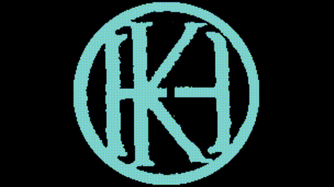

<div align="center" style="margin-bottom: 10px;">
    <a href="https://twitter.com/intent/follow?screen_name=kennbroorg">
	
    </a>
</div>

<div align="center" style="margin-bottom: 10px;">
    
    
</div>

---

<div align="center">
    
</div>

---

<h1 align="center">tracKenn</h1>

<h1 id="description">Description</h1>
Traceability project in blockchain. Ethereum and some features in Binance Smart Chain for now. Transactions, internals, ERC-20 transfers, contracts, internal tagging, labeling, etc

---

<div align="center">
    <a href="https://vimeo.com/917133268?share=copy"></a>
</div>
<div align="center">
    <a href="https://vimeo.com/917133268?share=copy">Video Demo</a>
</div>

<h1 id="installation">Installation</h1>

For now

``` shell
git clone https://github.com/kennbroorg/trackenn.git    # Clone repo
cd trackenn                                             # Enter to directory cloned
pip install -r requirements.txt                         # Install dependencies
python3 app.py                                          # Execute the app
```

And, finally, [browse](#browse) it.

<h3 id="browser">Browse</h3>

Open the browser in this [url](http://127.0.0.1:4200)

# API Keys

Before start to use this software, you must get an API key from [etherscan](https://etherscan.io/apis) and/or [bscscan](https://bscscan.com/apis), free is enough, and edit the file named config.yaml and change the 'XXX' for your API

```
ethscan: XXX
bscscan: XXX
level: INFO
dbname: default.db
```

<h1 id="sponsor">Support the project</h1>
Whether you use this project, have learned something from it, or just like it, please consider supporting it by buying me a coffee, so I can dedicate more time on open-source projects like this.


<div align="center" style="margin-top: 30px;">
<a href="https://www.buymeacoffee.com/kennbro" target="_blank"></a>
</div>

# Disclaimer

Anyone who contributes or contributed to the project, including me, is not responsible for the use of the tool (Neither the legal use nor the illegal use, nor the "other" use).

Keep in mind that this software was initially written for educational purposes (to educate ourselves), and now the goal is to collaborate with the community making quality free software, and while the quality is not excellent (sometimes not even good) we strive to pursue excellence.

Please load the necessary APIs before remembering my mother. You can create an issue, contact us by e-mail or by any of the RRSS, with love, but keep in mind that my mother is neither the creator nor Contribute to the project.

We do not refund your money if you are not satisfied.
I hope you enjoy using the tool as much as we enjoy doing it. The effort was and is enormous (Time, knowledge, coding, tests, reviews, etc.) but we would do it again.
Do not use the tool if you cannot read the instructions and / or this disclaimer clearly.

By the way, for those who insist on remembering my mother, she died many years ago but I love her as if she were right here.

